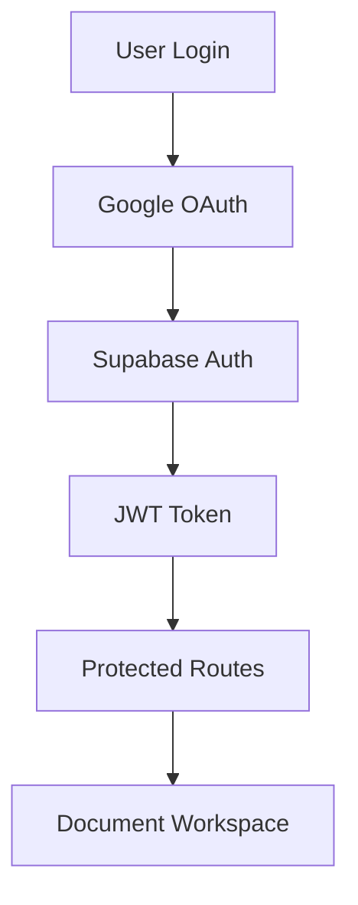

# 🏗️ Prismy Architecture Overview

*Production-ready AI document translation platform - Clean foundation after v1.0.0-recovery*

## 🎯 Quick Start (≤30 minutes)

```bash
# 1. Clone & setup
git clone <repo>
cd prismy-production
npm install

# 2. Environment setup
cp .env.example .env.local
# Fill in Supabase + Stripe keys

# 3. Development
npm run dev          # Start development server
npm run test         # Run test suite
npm run lint         # Check code quality
```

## 📁 Project Structure

```
prismy-production/
├── app/                    # Next.js 15 App Router
│   ├── api/               # API routes (upload, auth, payments)
│   ├── [locale]/          # Internationalized pages
│   └── app/               # Main workspace interface
├── components/            # Reusable UI components
│   ├── ui/               # Design system (Button, Input, etc.)
│   ├── auth/             # Authentication components
│   └── workspace/        # Document workspace UI
├── lib/                  # Core business logic
│   ├── supabase.ts       # Database client
│   ├── translation-service.ts  # AI translation engine
│   ├── payments/         # Stripe integration
│   └── design-tokens.ts  # Design system tokens
├── .github/workflows/    # CI/CD pipelines
└── docs/                 # Documentation
```

## 🔐 Authentication Flow



**Key Files:**
- `app/auth/callback/route.ts` - OAuth callback handler
- `lib/supabase-browser.ts` - Client-side auth
- `middleware.ts` - Route protection

## 🚀 Translation Pipeline


**Key Components:**
- `lib/document-processor.ts` - File parsing (PDF, DOCX, etc.)
- `lib/intelligent-chunking.ts` - Smart text segmentation
- `lib/translation-service.ts` - Multi-provider AI translation

## 🏛️ Database Schema (Supabase)

```sql
-- Core tables
user_credits         -- Credit tracking (freemium model)
translation_jobs     -- Document processing queue
chat_messages        -- LLM conversations
```

## 💳 Payment Architecture

- **Stripe Integration**: Subscription management
- **Credit System**: Freemium model with usage tracking
- **Vietnamese Payments**: Local payment gateway support

## 🔧 Development Workflow

### Commit Convention
```bash
feat: add new feature
fix: bug fix
docs: documentation
test: testing changes
chore: maintenance
```

### Quality Gates
```bash
# Pre-commit (automatic)
lint-staged → ESLint + Prettier

# Pre-push (automatic)
type-check → test:coverage → security-audit

# PR Checks (CI)
validate → test → security → build → deploy
```

### Code Quality Standards
- **TypeScript**: Strict mode enabled
- **ESLint**: Next.js + accessibility rules
- **Test Coverage**: 80% minimum threshold
- **Design Tokens**: No hardcoded values

## 🚨 Monitoring & Alerts

- **Sentry**: Error tracking & performance monitoring
- **Vercel Analytics**: Usage metrics
- **GitHub Actions**: CI/CD status
- **Supabase Dashboard**: Database health

## 🔄 Deployment Pipeline

```
Feature Branch → PR → Tests Pass → Staging → Production
                ↓
            Auto-deploy via Vercel
```

**Environments:**
- **Development**: `localhost:3000`
- **Staging**: `prismy-staging.vercel.app`
- **Production**: `prismy.in`

## 📊 Performance Budgets

- **Bundle Size**: <250 kB (gzipped)
- **Core Web Vitals**: 
  - LCP: <2.5s
  - CLS: <0.1
  - FID: <100ms

## 🛡️ Security Measures

- **CSP Headers**: Content Security Policy
- **Auth Protection**: JWT + RLS policies
- **API Rate Limiting**: Redis-based throttling
- **Secrets Management**: Environment variables only

## 🧪 Testing Strategy

```bash
npm run test:unit        # Jest unit tests
npm run test:e2e         # Playwright integration
npm run test:mutation    # Stryker mutation testing
npm run test:visual      # Visual regression
```

## 📝 Maintenance Schedule

- **Weekly**: Dependency updates (Dependabot)
- **Bi-weekly**: Technical debt review
- **Monthly**: Security audit & performance review

---

## 🆘 Emergency Contacts

- **Deployment Issues**: Check Vercel dashboard
- **Database Issues**: Supabase dashboard + logs
- **Payment Issues**: Stripe dashboard

## 📚 Key Resources

- [Design System](./DESIGN_SYSTEM.md)
- [API Documentation](./API.md)
- [Deployment Guide](./DEPLOYMENT.md)
- [Security Checklist](./SECURITY.md)

---

*Last updated: v1.0.0-recovery | Next review: 2 weeks*