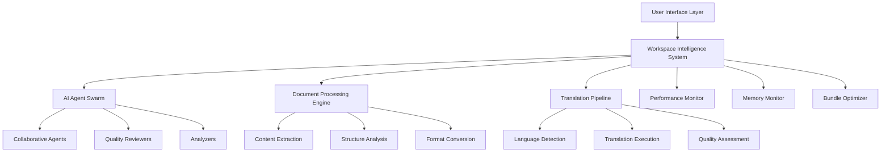

# Prismy Technical Documentation

## Overview

Prismy is a production-ready AI-powered translation platform featuring an advanced workspace intelligence system, collaborative AI agents, and comprehensive document processing capabilities. This documentation provides in-depth technical details about the system architecture, implementation, and usage.

## Table of Contents

1. [Architecture](#architecture)
2. [Core Systems](#core-systems)
3. [AI Intelligence Framework](#ai-intelligence-framework)
4. [Performance Optimization](#performance-optimization)
5. [Testing Strategy](#testing-strategy)
6. [Deployment Guide](#deployment-guide)
7. [API Reference](#api-reference)
8. [Development Workflow](#development-workflow)

## Architecture

### System Overview

Prismy follows a modern, scalable architecture built on Next.js 13+ with App Router, featuring:

- **Microservice-oriented frontend architecture**
- **AI-powered workspace intelligence**
- **Real-time collaborative agent system**
- **Advanced performance monitoring**
- **Comprehensive testing infrastructure**



### Technology Stack

#### Frontend

- **Framework**: Next.js 13+ (App Router)
- **UI Library**: React 18 with TypeScript
- **Styling**: Tailwind CSS + Custom Design System
- **Animations**: Framer Motion
- **State Management**: React Context + Custom Hooks

#### Backend Services

- **Database**: Supabase (PostgreSQL)
- **Authentication**: Supabase Auth
- **File Storage**: Supabase Storage
- **Real-time**: Supabase Realtime

#### AI & Processing

- **Language Models**: OpenAI GPT-4, Anthropic Claude
- **Document Processing**: Custom PDF/DOCX parsers
- **Translation API**: Multi-provider aggregation
- **AI Orchestration**: Custom agent swarm system

#### Performance & Monitoring

- **Performance Monitoring**: Custom advanced monitor
- **Memory Management**: Leak detection system
- **Bundle Optimization**: Advanced code splitting
- **Error Tracking**: Custom error boundaries

## Core Systems

### 1. Workspace Intelligence System

The workspace intelligence system is the central nervous system of Prismy, tracking user activities, patterns, and providing intelligent suggestions.

**Location**: `/contexts/WorkspaceIntelligenceContext.tsx`

#### Key Features

- **Activity Tracking**: Records all user interactions and operations
- **Pattern Recognition**: Learns from user behavior to optimize workflows
- **Smart Suggestions**: Provides contextual recommendations
- **Performance Insights**: Analyzes efficiency and bottlenecks

#### Implementation

```typescript
interface WorkspaceIntelligenceState {
  currentMode: WorkspaceMode
  context: WorkspaceContext
  activities: Activity[]
  patterns: UserPattern
  activeOperations: AIOperation[]
  suggestions: SmartSuggestion[]
  insights: WorkspaceInsight[]
  isProcessing: boolean
  connectionStatus: 'connected' | 'disconnected' | 'reconnecting'
}
```

#### Usage

```typescript
const { state, operations, suggestions } = useWorkspaceIntelligence()

// Start an operation
await operations.start({
  type: 'translation',
  input: { text: 'Hello world', targetLanguage: 'vi' },
})

// Apply a suggestion
await suggestions.apply(suggestionId)
```

### 2. AI Agent Swarm System

The AI agent system enables collaborative AI workflows with multiple specialized agents working together.

**Location**: `/components/workspace/IntelligenceHub.tsx`

#### Agent Types

- **Translator Agents**: Specialized in language pairs
- **Quality Reviewers**: Focus on translation quality
- **Document Analyzers**: Extract and analyze content
- **Contextual Assistants**: Provide real-time help

#### Collaboration Framework

```typescript
interface Agent {
  id: string
  name: string
  type: 'translator' | 'reviewer' | 'analyzer' | 'assistant'
  specialization: string[]
  status: 'idle' | 'active' | 'busy' | 'offline'
  capabilities: string[]
  performance: PerformanceMetrics
  collaboration: CollaborationProfile
}
```

#### Agent Communication

```typescript
// Start collaboration
const session = await startCollaboration({
  agents: ['translator-alpha', 'reviewer-beta'],
  task: {
    type: 'translation_with_review',
    input: documentContent,
    qualityThreshold: 0.92,
  },
})

// Monitor progress
session.on('progress', update => {
  console.log(`${update.stage}: ${update.progress}%`)
})
```

### 3. Document Processing Engine

Advanced document processing with content extraction, structure analysis, and format conversion.

**Location**: `/components/documents/BatchUpload.tsx`

#### Supported Formats

- **PDF**: Full text extraction, structure preservation
- **DOCX**: Complete document parsing with formatting
- **TXT**: Plain text with encoding detection
- **Images**: OCR with text extraction

#### Processing Pipeline

1. **Upload & Validation**
2. **Content Extraction**
3. **Structure Analysis**
4. **Quality Assessment**
5. **Translation Preparation**

```typescript
interface DocumentProcessing {
  stages: ProcessingStage[]
  progress: number
  errors: ProcessingError[]
  warnings: ProcessingWarning[]
  resources: ResourceUsage
}
```

### 4. Translation Pipeline

Multi-provider translation system with quality assessment and optimization.

**Location**: `/components/workspace/SimpleTranslationInterface.tsx`

#### Translation Flow

```typescript
const translationPipeline = {
  // 1. Language Detection
  detectLanguage: async (text: string) => {
    return await languageDetector.detect(text)
  },

  // 2. Provider Selection
  selectProvider: (sourceLanguage: string, targetLanguage: string) => {
    return providerOptimizer.getBestProvider(sourceLanguage, targetLanguage)
  },

  // 3. Translation Execution
  translate: async (request: TranslationRequest) => {
    const result = await selectedProvider.translate(request)
    return qualityAssessment.evaluate(result)
  },

  // 4. Post-processing
  postProcess: (translation: Translation) => {
    return {
      ...translation,
      alternatives: generateAlternatives(translation),
      confidence: calculateConfidence(translation),
      suggestions: generateSuggestions(translation),
    }
  },
}
```

## AI Intelligence Framework

### Swarm Intelligence

The AI agent swarm uses collective intelligence to solve complex translation and analysis tasks.

#### Swarm Coordination

```typescript
class SwarmCoordinator {
  private agents: Map<string, Agent> = new Map()
  private tasks: TaskQueue = new TaskQueue()
  private metrics: SwarmMetrics = new SwarmMetrics()

  async assignTask(task: AgentTask): Promise<TaskAssignment> {
    const suitableAgents = this.findSuitableAgents(task)
    const optimalTeam = this.optimizeTeamComposition(suitableAgents, task)

    return this.createTaskAssignment(task, optimalTeam)
  }

  private findSuitableAgents(task: AgentTask): Agent[] {
    return Array.from(this.agents.values()).filter(
      agent =>
        agent.capabilities.some(cap =>
          task.requiredCapabilities.includes(cap)
        ) &&
        agent.status === 'idle' &&
        this.calculateSuitabilityScore(agent, task) > 0.7
    )
  }
}
```

#### Agent Learning

```typescript
interface AgentLearning {
  adaptationRate: number
  learningEfficiency: number
  retentionRate: number
  knowledgeBase: KnowledgeItem[]
  collaborationHistory: CollaborationSession[]
}

// Continuous learning from interactions
agent.learn({
  interaction: collaborationSession,
  feedback: qualityMetrics,
  outcome: taskResult,
})
```

### Contextual Intelligence

Real-time contextual assistance based on user activities and workspace state.

```typescript
class ContextualIntelligence {
  analyzeContext(workspaceState: WorkspaceIntelligenceState): ContextAnalysis {
    return {
      currentFocus: this.identifyCurrentFocus(workspaceState),
      userIntent: this.predictUserIntent(workspaceState),
      optimizationOpportunities: this.findOptimizations(workspaceState),
      suggestedActions: this.generateSuggestions(workspaceState),
    }
  }

  private predictUserIntent(state: WorkspaceIntelligenceState): UserIntent {
    const patterns = state.patterns
    const recentActivities = state.activities.slice(-10)

    return this.intentPredictor.predict({
      patterns,
      recentActivities,
      currentMode: state.currentMode,
    })
  }
}
```

## Performance Optimization

### Advanced Performance Monitoring

Comprehensive performance tracking with real-time metrics and automated optimization.

**Location**: `/lib/performance/advanced-monitor.ts`

#### Key Metrics

- **Rendering Performance**: Component render times, FPS monitoring
- **Memory Usage**: Heap monitoring, leak detection
- **Network Performance**: Request timing, cache efficiency
- **Bundle Analysis**: Size optimization, code splitting effectiveness

#### Usage

```typescript
import { performanceMonitor } from '@/lib/performance/advanced-monitor'

// Start monitoring
performanceMonitor.startMonitoring({
  samplingRate: 1.0,
  onViolation: violation => {
    console.warn('Performance budget violated:', violation)
  },
})

// Record custom metrics
performanceMonitor.recordMetric({
  id: 'translation-time',
  name: 'Translation Duration',
  value: translationTime,
  unit: 'ms',
  category: 'ai_processing',
  severity: translationTime > 5000 ? 'high' : 'low',
})
```

### Component Performance Profiler

React component performance monitoring with automatic optimization suggestions.

**Location**: `/components/performance/ComponentProfiler.tsx`

#### Features

- **Real-time Profiling**: Live component performance tracking
- **Optimization Suggestions**: Automatic recommendations
- **Memory Tracking**: Component memory usage monitoring
- **Render Analysis**: Detailed render performance metrics

#### Usage

```typescript
import { ComponentProfiler, withProfiler } from '@/components/performance/ComponentProfiler'

// HOC usage
const ProfiledComponent = withProfiler(MyComponent, {
  id: 'my-component',
  detailed: true
})

// Wrapper usage
<ComponentProfiler id="translation-interface" detailed>
  <SimpleTranslationInterface />
</ComponentProfiler>
```

### Memory Leak Detection

Advanced memory monitoring with automatic leak detection and cleanup.

**Location**: `/lib/performance/memory-monitor.ts`

#### Features

- **Leak Detection**: Automatic identification of memory leaks
- **Cleanup Automation**: Automatic cleanup of orphaned resources
- **Threshold Monitoring**: Configurable memory thresholds
- **Trend Analysis**: Memory usage trend analysis

#### Usage

```typescript
import {
  memoryMonitor,
  useMemoryMonitor,
} from '@/lib/performance/memory-monitor'

// Hook usage
const { getMemoryUsage, performCleanup } = useMemoryMonitor({
  enabled: true,
  onLeakDetected: leak => {
    console.warn('Memory leak detected:', leak)
  },
})

// Manual monitoring
memoryMonitor.startMonitoring({
  onLeakDetected: handleLeak,
  onThresholdExceeded: handleThreshold,
})
```

### Bundle Optimization

Intelligent bundle analysis and optimization with code splitting strategies.

**Location**: `/lib/performance/bundle-optimizer.ts`

#### Features

- **Bundle Analysis**: Detailed bundle size and composition analysis
- **Code Splitting**: Automated code splitting strategies
- **Compression Analysis**: Multiple compression algorithm analysis
- **Tree Shaking**: Unused code detection and removal suggestions

#### Usage

```typescript
import { bundleOptimizer } from '@/lib/performance/bundle-optimizer'

// Analyze bundles
const analyses = await bundleOptimizer.analyzeBundles([
  { name: 'main', path: './dist/main.js' },
  { name: 'vendor', path: './dist/vendor.js' },
])

// Generate optimization strategies
const strategies = bundleOptimizer.generateSplittingStrategies(analyses)

// Get optimized config
const webpackConfig = bundleOptimizer.generateOptimizedConfig(
  'webpack',
  strategies[0]
)
```

## Testing Strategy

### Comprehensive Testing Infrastructure

Multi-layered testing approach with unit, integration, and end-to-end tests.

**Location**: `/__tests__/`

#### Testing Layers

1. **Unit Tests**: Individual component and function testing
2. **Integration Tests**: Workflow and system integration testing
3. **Performance Tests**: Performance regression testing
4. **Accessibility Tests**: WCAG compliance testing

#### Test Structure

```
__tests__/
├── components/          # Component unit tests
│   ├── ui/             # UI component tests
│   ├── workspace/      # Workspace component tests
│   ├── documents/      # Document component tests
│   └── auth/           # Authentication component tests
├── integration/        # Integration tests
│   ├── translation-workflow.test.tsx
│   ├── document-processing-workflow.test.tsx
│   └── ai-agent-collaboration.test.tsx
├── utils/              # Test utilities
│   └── test-utils.tsx  # Custom render functions and mocks
├── mocks/              # Mock implementations
│   └── server.ts       # MSW server setup
└── setup.ts           # Test environment setup
```

#### Test Utilities

```typescript
// Custom render with providers
export const renderWithProviders = (
  ui: ReactElement,
  options: CustomRenderOptions = {}
) => {
  return customRender(ui, {
    withAuth: true,
    withWorkspace: true,
    withTheme: true,
    ...options,
  })
}

// Mock data factories
export const createMockUser = (overrides = {}): User => ({
  id: 'test-user-123',
  email: 'test@example.com',
  // ... other properties
  ...overrides,
})
```

### Testing Best Practices

1. **Test Isolation**: Each test is independent and can run in isolation
2. **Mock External Dependencies**: All external APIs and services are mocked
3. **Accessibility Testing**: All components tested for WCAG compliance
4. **Performance Testing**: Critical paths tested for performance regressions
5. **Error Scenarios**: Comprehensive error handling testing

## Deployment Guide

### Environment Setup

#### Development Environment

```bash
# Install dependencies
npm install

# Set up environment variables
cp .env.example .env.local

# Start development server
npm run dev
```

#### Required Environment Variables

```env
# Supabase
NEXT_PUBLIC_SUPABASE_URL=your_supabase_url
NEXT_PUBLIC_SUPABASE_ANON_KEY=your_supabase_anon_key
SUPABASE_SERVICE_ROLE_KEY=your_service_role_key

# OpenAI
OPENAI_API_KEY=your_openai_api_key

# Anthropic
ANTHROPIC_API_KEY=your_anthropic_api_key

# Performance Monitoring
NEXT_PUBLIC_PERFORMANCE_MONITORING=true
NEXT_PUBLIC_MEMORY_MONITORING=true
```

#### Production Deployment

1. **Build Optimization**

```bash
# Analyze bundle
npm run analyze

# Build for production
npm run build

# Start production server
npm start
```

2. **Performance Configuration**

```javascript
// next.config.js
const config = {
  experimental: {
    webVitalsAttribution: ['CLS', 'LCP'],
  },
  compiler: {
    removeConsole: process.env.NODE_ENV === 'production',
  },
  webpack: (config, { dev, isServer }) => {
    if (!dev && !isServer) {
      // Enable advanced optimizations
      config.optimization.splitChunks.cacheGroups = {
        vendor: {
          test: /[\\/]node_modules[\\/]/,
          name: 'vendor',
          chunks: 'all',
        },
      }
    }
    return config
  },
}
```

3. **Monitoring Setup**

```typescript
// Enable performance monitoring in production
if (process.env.NODE_ENV === 'production') {
  performanceMonitor.startMonitoring({
    samplingRate: 0.1, // 10% sampling in production
    onViolation: violation => {
      // Send to monitoring service
      analytics.track('performance_violation', violation)
    },
  })
}
```

### CI/CD Pipeline

```yaml
# .github/workflows/deploy.yml
name: Deploy to Production

on:
  push:
    branches: [main]

jobs:
  test:
    runs-on: ubuntu-latest
    steps:
      - uses: actions/checkout@v3
      - uses: actions/setup-node@v3
        with:
          node-version: '18'
      - run: npm ci
      - run: npm run test
      - run: npm run test:integration

  build:
    needs: test
    runs-on: ubuntu-latest
    steps:
      - uses: actions/checkout@v3
      - uses: actions/setup-node@v3
        with:
          node-version: '18'
      - run: npm ci
      - run: npm run build
      - run: npm run analyze

  deploy:
    needs: build
    runs-on: ubuntu-latest
    steps:
      - uses: actions/checkout@v3
      - run: npm run deploy
```

## API Reference

### Workspace Intelligence API

#### Context Management

```typescript
// Get current workspace state
const state = useWorkspaceIntelligence()

// Update workspace context
await updateContext({
  activeDocuments: [documentId],
  cursor: { line: 10, column: 5 },
})

// Add activity
await addActivity({
  type: 'translation',
  status: 'completed',
  input: 'Hello world',
  output: 'Xin chào thế giới',
})
```

#### Operations Management

```typescript
// Start operation
const operation = await operations.start({
  type: 'document_processing',
  input: { file: documentFile, targetLanguages: ['vi', 'es'] },
})

// Update operation
await operations.update(operation.id, {
  progress: 50,
  status: 'processing',
})

// Complete operation
await operations.complete(operation.id, {
  result: processedDocument,
})
```

#### Suggestions System

```typescript
// Get suggestions
const suggestions = await getSuggestions({
  category: 'workflow_optimization',
  limit: 5,
})

// Apply suggestion
await applySuggestion(suggestion.id)

// Dismiss suggestion
await dismissSuggestion(suggestion.id)
```

### AI Agent API

#### Agent Management

```typescript
// Get available agents
const agents = await getAgents({
  type: 'translator',
  status: 'idle',
  specialization: ['en-vi'],
})

// Start collaboration
const session = await startCollaboration({
  agents: ['agent-1', 'agent-2'],
  task: {
    type: 'collaborative_translation',
    input: document,
    qualityThreshold: 0.92,
  },
})

// Monitor collaboration
session.on('message', message => {
  console.log(`${message.sender}: ${message.content}`)
})

session.on('progress', progress => {
  console.log(`Progress: ${progress.percentage}%`)
})
```

#### Task Management

```typescript
// Create task
const task = await createTask({
  title: 'Translate Technical Document',
  type: 'collaborative_translation',
  assignedAgents: ['translator-alpha', 'reviewer-beta'],
  input: {
    document: documentContent,
    sourceLanguage: 'en',
    targetLanguage: 'vi',
  },
  requirements: ['technical_accuracy', 'cultural_adaptation'],
})

// Get task status
const status = await getTaskStatus(task.id)

// Update task
await updateTask(task.id, {
  progress: 75,
  notes: 'Translation phase completed',
})
```

### Document Processing API

#### Upload and Processing

```typescript
// Upload document
const uploadResult = await uploadDocument({
  file: documentFile,
  targetLanguages: ['vi', 'es', 'fr'],
  processingOptions: {
    extractText: true,
    preserveFormatting: true,
    enableOCR: true,
  },
})

// Get processing status
const status = await getDocumentStatus(uploadResult.document.id)

// Get processed document
const document = await getDocument(documentId)
```

#### Batch Processing

```typescript
// Start batch processing
const batchResult = await startBatchProcessing({
  files: fileList,
  commonTargetLanguages: ['vi', 'es'],
  processingMode: 'parallel',
  priority: 'high',
})

// Monitor batch progress
const progress = await getBatchProgress(batchResult.batchId)

// Get batch results
const results = await getBatchResults(batchResult.batchId)
```

### Translation API

#### Translation Execution

```typescript
// Simple translation
const result = await translate({
  text: 'Hello world',
  sourceLanguage: 'en',
  targetLanguage: 'vi',
  options: {
    includeAlternatives: true,
    qualityThreshold: 0.9,
  },
})

// Document translation
const documentTranslation = await translateDocument({
  documentId: document.id,
  targetLanguage: 'vi',
  preserveFormatting: true,
  useCollaboration: true,
})
```

#### Quality Assessment

```typescript
// Assess translation quality
const quality = await assessQuality({
  sourceText: originalText,
  translatedText: translationResult,
  sourceLanguage: 'en',
  targetLanguage: 'vi',
})

// Get quality metrics
const metrics = await getQualityMetrics({
  translationId: translation.id,
  includeDetailed: true,
})
```

## Development Workflow

### Project Structure

```
prismy/
├── app/                    # Next.js App Router
│   ├── (auth)/            # Authentication routes
│   ├── dashboard/         # Dashboard pages
│   ├── documents/         # Document management
│   ├── translation/       # Translation interface
│   └── api/               # API routes
├── components/            # React components
│   ├── ui/               # Base UI components
│   ├── workspace/        # Workspace components
│   ├── documents/        # Document components
│   ├── auth/             # Authentication components
│   ├── performance/      # Performance monitoring
│   └── theme/            # Theme components
├── contexts/             # React contexts
├── lib/                  # Utility libraries
│   ├── performance/      # Performance monitoring
│   ├── utils.ts          # General utilities
│   └── validation.ts     # Validation schemas
├── types/                # TypeScript type definitions
├── styles/               # Styling
└── __tests__/            # Test files
```

### Code Standards

#### TypeScript Configuration

```json
{
  "compilerOptions": {
    "strict": true,
    "noUncheckedIndexedAccess": true,
    "exactOptionalPropertyTypes": true,
    "noImplicitReturns": true,
    "noFallthroughCasesInSwitch": true,
    "noImplicitOverride": true
  }
}
```

#### ESLint Configuration

```json
{
  "extends": [
    "next/core-web-vitals",
    "@typescript-eslint/recommended",
    "plugin:react-hooks/recommended"
  ],
  "rules": {
    "@typescript-eslint/no-unused-vars": "error",
    "@typescript-eslint/explicit-function-return-type": "warn",
    "react-hooks/exhaustive-deps": "error"
  }
}
```

#### Component Guidelines

1. **Functional Components**: Use function components with hooks
2. **TypeScript**: Strictly typed props and return types
3. **Performance**: Use React.memo, useMemo, useCallback when appropriate
4. **Accessibility**: Include ARIA labels and keyboard navigation
5. **Error Boundaries**: Wrap components in error boundaries

#### State Management

```typescript
// Use typed context for global state
interface AppState {
  user: User | null
  workspace: WorkspaceState
  ui: UIState
}

const AppContext = createContext<AppState | null>(null)

// Custom hooks for state access
export const useAppState = () => {
  const context = useContext(AppContext)
  if (!context) {
    throw new Error('useAppState must be used within AppProvider')
  }
  return context
}
```

### Performance Guidelines

1. **Bundle Size**: Keep initial bundle under 250KB
2. **Code Splitting**: Implement route-based and component-based splitting
3. **Lazy Loading**: Use dynamic imports for non-critical components
4. **Memory Management**: Monitor for memory leaks and implement cleanup
5. **Rendering**: Optimize component re-renders with profiling

### Security Guidelines

1. **Input Validation**: Validate all user inputs with Zod schemas
2. **XSS Prevention**: Sanitize HTML content and use dangerouslySetInnerHTML carefully
3. **Authentication**: Use secure authentication with proper session management
4. **API Security**: Implement rate limiting and input validation on API routes
5. **Environment Variables**: Never expose sensitive data in client-side code

---

This technical documentation provides comprehensive coverage of the Prismy platform's architecture, implementation details, and usage guidelines. For additional information or clarification, please refer to the inline code documentation or contact the development team.
